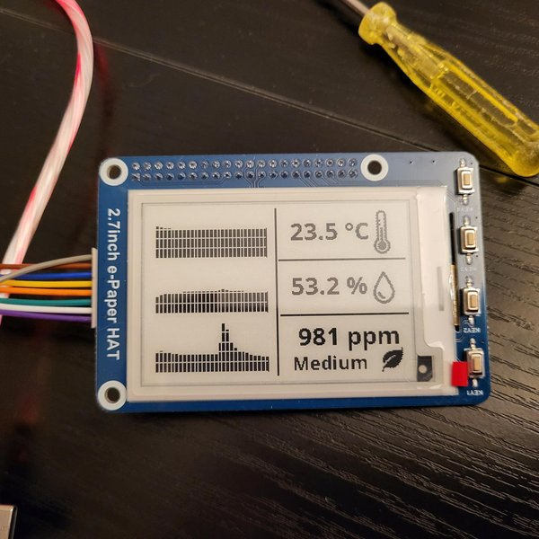
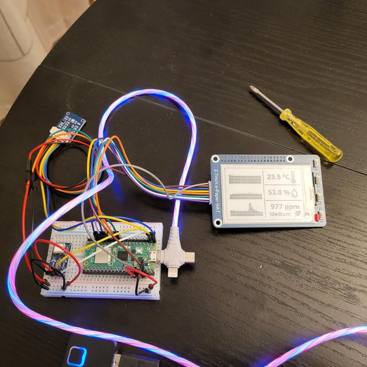
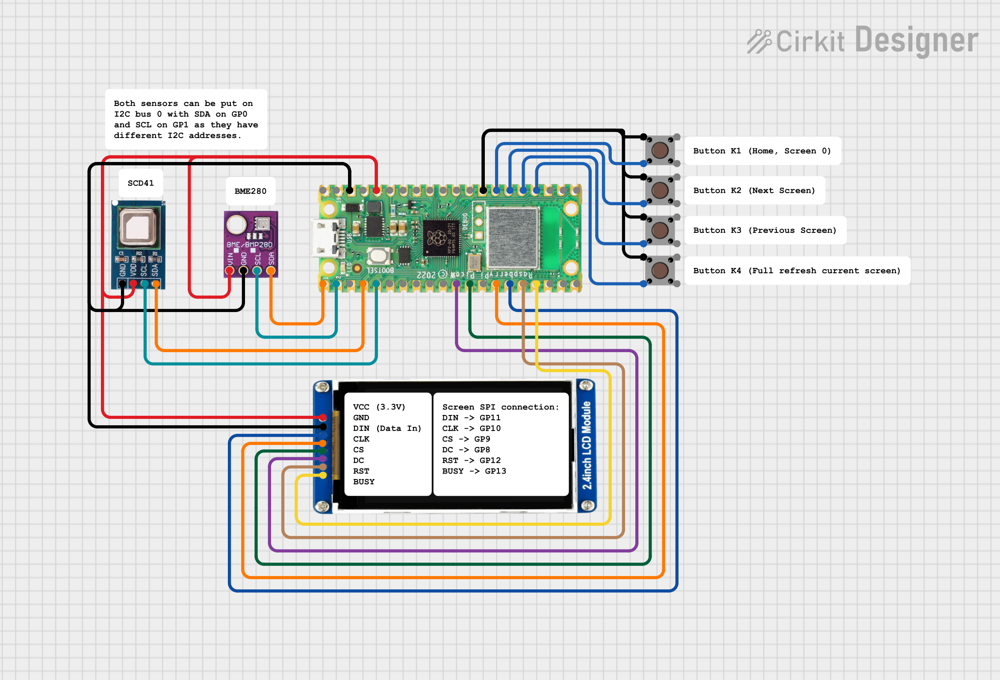
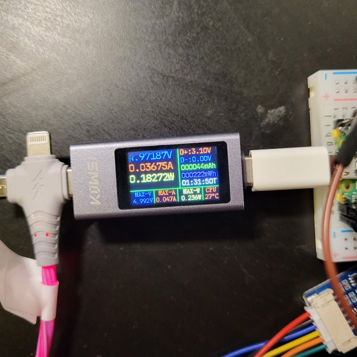

# Raspberry Pi Pico room climate monitor

A compact system based on the Raspberry Pi Pico designed for monitoring indoor climate conditions. The project integrates a <b>Raspberry Pi Pico 2 (RP2350)</b> microcontroller, a <b>Waveshare 2.7-inch E-Paper display module</b> (264 × 176 pixels), a <b>Waveshare BME280 environmental sensor</b>, and a <b>Hailege SCD41 CO₂ gas sensor</b>. Its purpose is to measure and display room temperature, humidity, atmospheric pressure, and CO₂ concentration. The software architecture is structured to support multiple screen layouts, which can be defined and switched via user input buttons.

# Screenshots

The following images illustrate the assembly of the system on a breadboard using jumper wires for all signal and power connections. The display is configured with a standard layout, presenting 15 minutes of historical data on the left side and three primary metrics on the right side: temperature, humidity, and CO₂ concentration. The on-screen buttons are currently not utilized; however, they are reserved for future functionality to allow switching between different display layouts.

<p align="center">
  
  
</p>

# Features
Shows current

* room temperaturen
* relative humidity
* CO2 concentration
* historic values

The firmware will be extended in future with further functionalities.

# Components
* <b>Raspberry Pi Pico 2 (RP2350) with presoldered pin header</b>
* <b>Waveshare 2.7-inch E-Paper display module</b> (264 × 176 pixels)
* <b>(Waveshare) BME280 environmental sensor</b>
* <b>(Hailege) SCD41 CO₂ gas sensor</b>

# Remarks

## BME280 sensor

This project utilises the Waveshare BME280 environmental sensor and the Hailege SCD41 CO₂ gas sensor breakout boards. During testing, the temperature and humidity readings from the BME280 were noticeably less accurate than those from the SCD41 when compared against an existing reference weather sensor in the room. The BME280 is retained in this design primarily to provide atmospheric pressure data and to enable a barometric function (planned for future implementation). If your application does not require barometric pressure, you can omit the BME280 and replace the pressure value in main.py with a fixed or dummy value.

The <a href="src/main.py"><b>main.py</b></a> file acts as the central module, handling sensor data acquisition and triggering screen updates. In contrast, the display layouts are defined in <a href="src/screen_manager.py"><b>screen_manager.py</b></a>, where you can configure and customize the screen layouts according to your requirements.

## No RTC clock required for this system

For development and testing, a Raspberry Pi Pico 2W is used, although this project does not rely on Wi‑Fi or Bluetooth connectivity. The logger.py module records measurement data relative to the datetime set at power-up. Because log data is stored in RAM, it is lost when the device is powered down, and the long-term logging buffer requires another 24 hours of operation to be refilled. Consequently, precise real-time clock accuracy is not critical for this application.


## Third-party libraries

This project uses Peter Hinch’s <a href="src/third_party_lib/write.py"><b>write.py</b></a> module from the <a href="https://github.com/peterhinch/micropython-font-to-py"><b>micropython-font-to-py</b></a> library. It is recommended not to modify this module within the project. Only update it as a whole file when necessary to incorporate a newer upstream version or bug fixes.

The <a href="src/drivers/screen_waveshare_2p7inch_module.py"><b>screen_waveshare_2p7inch_module.py</b></a> is the primary micropython driver for the 2.7-inch screen. It is also a third-party library which has been modified to allow to refresh the landscape frame buffer in partial and fast mode. The original file can be found <a href="https://github.com/waveshareteam/Pico_ePaper_Code/blob/main/python/Pico-ePaper-2.7_V2.py">here</a>.

# Getting started

This section describes assembling the hardware and installing the firmware for this system.

## Assembly

In this section, the assembly of the system is described. As mentioned in the introduction, the system integrates a <b>Raspberry Pi Pico microcontroller</b>, a <b>Waveshare 2.7‑inch E‑Paper display module</b> (264 × 176 pixels), a <b>Waveshare BME280</b> environmental sensor, and a <b>Hailege SCD41 CO₂</b> gas sensor. 

Both sensors are connected to I2C bus 0, with the clock line (<b>SCL</b>) on <b>GP1</b> and the data line (<b>SDA</b>) on <b>GP0</b> of the Raspberry Pi Pico:

* SCL → GP1
* SDA → GP0

Both devices can share the same general‑purpose pins because they use different I2C addresses (BME280: <b>0x77</b>, SCD41: <b>0x62</b>). The sensors can be powered from either 3.3 V or 5 V, so they may be connected to <b>3V3(OUT)</b>, <b>VSYS</b>, or <b>VBUS</b> on the Pico depending on your power‑supply configuration. So, three power pins can be used at the same time.

<p align="center">
  
</p>

The display is wired using a JST‑to‑Dupont cable (<b>PH2.0, 20 cm, 8‑pin×1</b>), which is typically supplied with the module. The connections to the display are as follows:

* DIN → GP11
* CLK → GP10
* CS → GP9
* DC → GP8
* RST → GP12
* BUSY → GP13

## Firmware installation

### [1] Install MicroPython firmware on the Raspberry Pi Pico

When you have a completely new Raspberry Pi Pico 2, you will need to flash the MicroPython runtime onto the microcontroller. This is usually a very simple process. You can find an excellent tutorial at

<a href="https://www.raspberrypi.com/documentation/microcontrollers/micropython.html"><b>Flashing the Micropython runtime library on Raspberry Pi Pico</b></a>

The firmware for the Pico 2 version without a Wi‑Fi chip can be downloaded <a href="https://micropython.org/download/RPI_PICO2/RPI_PICO2-latest.uf2"><b>here</b></a>. Once the download is complete, press and hold the <b>BOOTSEL</b> button on the Pico while connecting it to your computer with a USB cable. After it is connected, release the <b>BOOTSEL</b> button - a new flash drive will appear in your computer’s file system. Drag and drop the downloaded firmware file onto this flash drive. When the copying is complete, the Pico will automatically unmount the drive. At this point, the MicroPython runtime has been successfully flashed onto your Raspberry Pi Pico board.

### [2] Installing Thonny editor and connect it with the Raspberry Pi Pico board

I usually use the <a href="https://thonny.org/"><b>Thonny editor</b></a> to transfer Python files onto the Raspberry Pi Pico board. I don’t use the editor for coding, but only to upload files to the board or make quick on‑the‑fly code adjustments.

This <a href="https://projects.raspberrypi.org/en/projects/getting-started-with-the-pico/0"><b>tutorial</b></a> explains the first steps with the Thonny editor and Raspberry Pi Pico very well. Alternatively, this <a href="https://www.youtube.com/watch?v=_ouzuI_ZPLs"><b>YouTube tutorial</b></a> also explains how to use the editor both for coding and for transferring files to the Pico board.

### [3] Downloading and installing the firmware on Raspberry Pi Pico 2

3.1. **Download the repository onto your local hard drive**:

```sh
   git clone git@github.com:Damov/raspberry_pi_room_climate_screen.git
```

3.2. **Transfer firmware on the Raspberry Pi Pico 2**:

Open the Thonny editor and select the Pico’s Python interpreter (it will appear in the list once the Pico is connected via a USB cable). In the editor's filesystem window, navigate to the folder on your computer where you cloned the repository. Once inside the repository, enter the subfolder <b>src/</b>. Now select all files from this subfolder, right‑click, and choose <b>Upload to /</b>. This will transfer everything from the <b>src/</b> subfolder to the Pico’s root directory. After the transfer is complete, you can disconnect the Pico from your computer and connect it to a power source using a USB cable. The system should now boot up and run the software.


<b>Note:</b> During boot, the MicroPython runtime on the board will look for the file <b>main.py</b> and execute it automatically. You can also run it manually from the Thonny editor. Simply double‑click <b>main.py</b> in the board’s file system. A new window will open showing the code with the title <b>[main.py]</b>. It’s important that the filename appears inside square brackets - this indicates that you’ve opened the file from the board’s storage, not from your computer. When you click the green <b>“Run”</b> button in Thonny, the code will execute directly on the board.

# Todo

* ~~Let the onboard LED blink if there was somewhere an Exception raised and in main() not handeled (to indicated that the device crashed entirely)~~
* ~~Write an unhandeled exception to the permanent storage of the raspberry pi pico as text file~~
* Put the code, which updates the screen in try...except block and prevent out of memory exception
* ~~Redesign the logger class more memory efficient (right now this class is too heavy for PICO's RAM)~~
* Define a long‑term logger for at least 24 h of data and create a dedicated screen to plot the history.
* Define all configuration parameters in a config.ini file and load them at runtime.

* Implement button handling to switch between multiple screen layouts.
* Add a barometer function and a simple weather forecast based on pressure trends over the last 3 hours.
* Design a 3D‑printable enclosure and publish the 3D model (e.g. as a download link).
* Optional: Improve calibration of the sensor readings.
* Optional: Add a buzzer for acoustic alerts.
* Optional: Integrate a Waveshare UPS module for Raspberry Pi Pico with I²C status monitoring.

# Known issues

* Waveshare display class driver can cause out of memory exception

# Energy consumption

The average power consumption was measured using a USB power meter capable of tracking voltage and current, as shown in the image below:

<p align="center">
  
</p>

Over a period of 1 hour and 32 minutes, the device consumed <b>222 mWh</b> of energy. This corresponds to an average power consumption of <b>144 mW<B7> and an average current draw of <b>28.7 mA</b>. With an 1800 mAh LiPo battery, the device would operate for approximately 2 days and 12 hours. Therefore, for a stationary home installation, it is more practical to power the device directly via a USB wall adapter.

# Contributing

Contributions are welcome! Please feel free to submit a Pull Request.

# License
This project is licensed under the MIT License - see the LICENSE file for details.

# Acknowledgements
* <a href="https://github.com/peterhinch"><b>Peter Hinch</b></a>: For the writer class used for text rendering and font_to_py for fonts.
* <a href="https://github.com/waveshareteam/Pico_ePaper_Code"><b>Waveshare</b></a>: For the ePaper display and driver.
display 