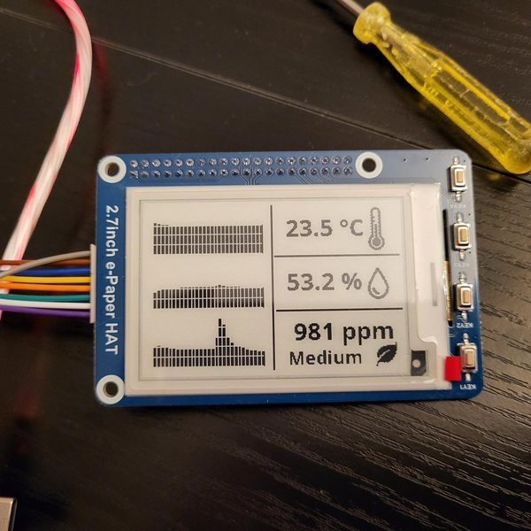
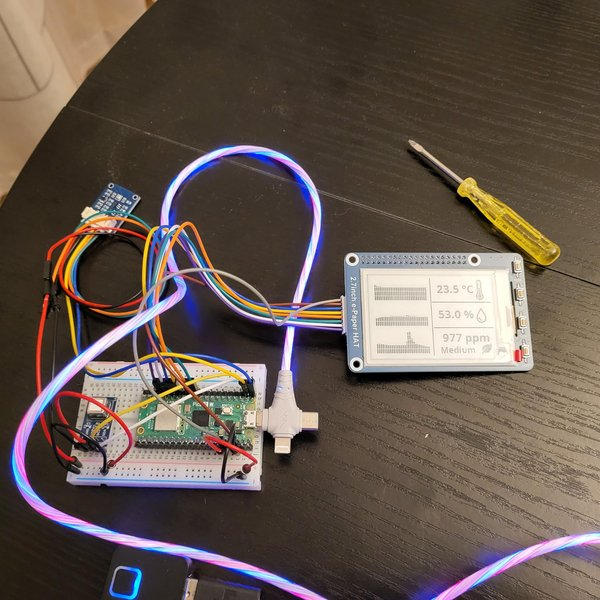
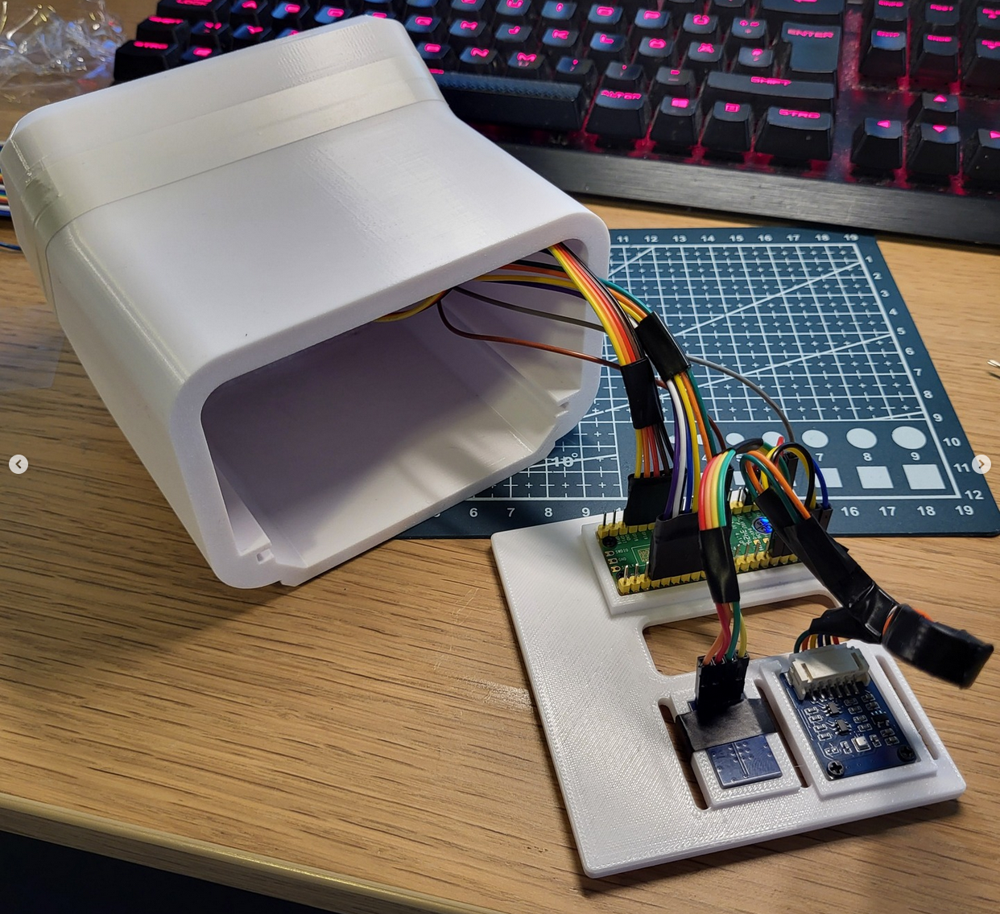
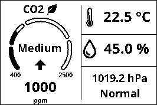
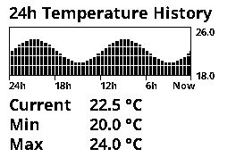
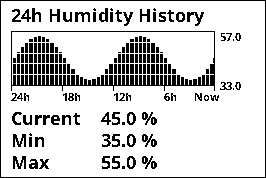
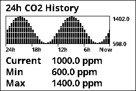
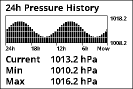
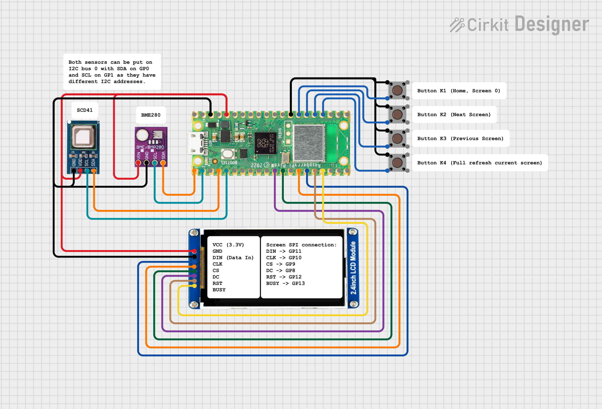
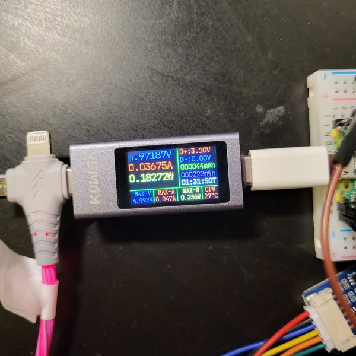

# Raspberry Pi Pico room climate monitor

A compact system based on the Raspberry Pi Pico designed for monitoring indoor climate conditions. The project integrates a <b>Raspberry Pi Pico 2 (RP2350)</b> microcontroller, a <b>Waveshare 2.7-inch E-Paper display module</b> (264 × 176 pixels), a <b>Waveshare BME280 environmental sensor</b>, and a <b>Hailege SCD41 CO₂ gas sensor</b>. Its purpose is to measure and display room temperature, humidity, atmospheric pressure, and CO₂ concentration. The software architecture is structured to support multiple screen layouts, which can be defined and switched via user input buttons.

# Screenshots

The following images illustrate the assembly of the system on a breadboard using jumper wires for all signal and power connections. The display is configured with a standard layout, presenting 15 minutes of historical data on the left side and three primary metrics on the right side: temperature, humidity, and CO₂ concentration. The four buttons select the home screen, previous layout, next layout, or a full refresh of the current view.

<p align="center">
  
  
  
</p>

# New firmware design

The front page presents the current CO₂ concentration on the left, using a semicircular scale with Good / Medium / Bad / Very Bad in its centre and the value in ppm below. A short arrow indicates whether the concentration is rising or falling. Changes of 5% or less show no arrow. On the right, horizontal lines separate temperature, relative humidity, and sea-level pressure. The thermometer and water-drop symbols identify the first two readings, while Low / Normal / High indicates the pressure conditions. The following previews use illustrative readings.

<p align="center">
  
</p>

The four 24-hour history pages display temperature, relative humidity, CO₂ concentration, and local atmospheric pressure. Each page presents a chart of 30-minute averages, followed by Current, Min, and Max in three aligned rows with their corresponding units. The time axis shows how many hours ago the measurements were recorded. The most recent values appear on the right. History is stored in RAM and starts again when the device is restarted.

<p align="center">
  
  
  
  
</p>

# Features
Shows current

* room temperaturen
* relative humidity
* CO2 concentration
* historic values

The firmware will be extended in future with further functionalities.

# Components
* <b>Raspberry Pi Pico 2 (RP2350) with presoldered pin header</b>
* <b>Waveshare 2.7-inch E-Paper display module</b> (264 × 176 pixels)
* <b>(Waveshare) BME280 environmental sensor</b>
* <b>(Hailege) SCD41 CO₂ gas sensor</b>

# Remarks

## Software architecture

The <a href="src/main.py"><b>main.py</b></a> file acts as the central module, handling sensor data acquisition and triggering screen updates. In contrast, the display layouts are defined in <a href="src/screen_manager.py"><b>screen_manager.py</b></a>, where you can configure and customize the screen layouts according to your requirements.

## No RTC clock required for this system

For development and testing, a Raspberry Pi Pico 2W is used, although this project does not rely on Wi‑Fi or Bluetooth connectivity. The logger.py module records measurement data relative to the datetime set at power-up. Because log data is stored in RAM, it is lost when the device is powered down, and the long-term logging buffer requires another 24 hours of operation to be refilled. Consequently, precise real-time clock accuracy is not critical for this application.


## Third-party libraries

This project uses Peter Hinch’s <a href="src/third_party_lib/write.py"><b>write.py</b></a> module from the <a href="https://github.com/peterhinch/micropython-font-to-py"><b>micropython-font-to-py</b></a> library. It is recommended not to modify this module within the project. Only update it as a whole file when necessary to incorporate a newer upstream version or bug fixes.

The <a href="src/drivers/screen_waveshare_2p7inch_module.py"><b>screen_waveshare_2p7inch_module.py</b></a> is the primary micropython driver for the 2.7-inch screen. It is also a third-party library which has been modified to allow to refresh the landscape frame buffer in partial and fast mode. The original file can be found <a href="https://github.com/waveshareteam/Pico_ePaper_Code/blob/main/python/Pico-ePaper-2.7_V2.py">here</a>.

# Getting started

This section describes assembling the hardware and installing the firmware for this system.

## Case geometry

The case geometry can be found in the <b>geometry</b> subfolder. This folder contains for the particular version the <b>STEP files</b> and the </b>3MF file</b>, which is suitable for 3D printing. The versioning of the case geometry does not necessarily correspond to the main firmware version number. Future versions of the case will be stored in this subfolder and labeled with their respective version numbers. The <b>3MF file</b> is typically optimized for the <b>Bambu Lab P1S</b> printer and may require adjustments for other printer models.

## Assembly

In this section, the assembly of the system is described. As mentioned in the introduction, the system integrates a <b>Raspberry Pi Pico microcontroller</b>, a <b>Waveshare 2.7‑inch E‑Paper display module</b> (264 × 176 pixels), a <b>Waveshare BME280</b> environmental sensor, and a <b>Hailege SCD41 CO₂</b> gas sensor.

The <b>BME280</b> sensor is connected to I2C bus 0, with the clock line (<b>SCL</b>) on <b>GP1</b> and the data line (<b>SDA</b>) on <b>GP0</b> of the Raspberry Pi Pico:

* SDA → GP0
* SCL → GP1

The <b>SCD51</b> sensor is connected to I2C bus 1, with the clock line (<b>SCL</b>) on <b>GP3</b> and the data line (<b>SDA</b>) on <b>GP2</b> of the Raspberry Pi Pico:

* SDA → GP2
* SCL → GP3

In this project, both sensors are using different I2C busses. However, both devices could also share the same I2C bus because they use different I2C addresses (BME280: <b>0x77</b>, SCD41: <b>0x62</b>). The sensors can be powered from either 3.3 V or 5 V, so they may be connected to <b>3V3(OUT)</b>, <b>VSYS</b>, or <b>VBUS</b> on the Pico depending on your power‑supply configuration. So, three different power pins can be used at the same time.

<p align="center">
  
</p>

The display is wired using a JST‑to‑Dupont cable (<b>PH2.0, 20 cm, 8‑pin×1</b>), which is typically supplied with the module. The connections to the display are as follows:

* DIN → GP11
* CLK → GP10
* CS → GP9
* DC → GP8
* RST → GP12
* BUSY → GP13

To control the screen, four buttons (K1, K2, K3, K4) are used. Currently, five screen layouts are defined. The K4 button returns to screen 0 (the home screen), K3 (Up) switches to the previous screen layout, K2 (Down) advances to the next layout, and K1 refreshes the current view, as e‑Paper displays can sometimes show visual artifacts. The buttons share a common ground connection on the <b>Raspberry Pi Pico microcontroller</b>, with the <b>GP21</b> pin assigned to <b>K1</b>, <b>GP20</b> to <b>K2</b>, <b>GP19</b> to <b>K3</b>, and <b>GP18</b> to <b>K4</b> button:

* GND → K1 → GP21
* GND → K2 → GP20
* GND → K3 → GP19
* GND → K4 → GP18

Holding a button does nothing. Each completed press triggers one action only after the button is released. Both pressing and releasing must remain stable for 40 ms; very brief taps or glitches are ignored. Navigation wraps between layouts 0 and 4. Buttons held during startup must be released before they can trigger an action; that initial release does not trigger an action.

Buttons are sampled every 10 ms independently of sensor reads and e-paper refreshes. Completed clicks released while the display is busy are queued and applied in order once it is ready; the resulting layout is refreshed once per batch using the latest sensor data. Simultaneous releases are processed in K1, K2, K3, K4 order. The queue holds 32 presses; if it fills, additional presses are discarded and an overflow message is printed. Button actions do not trigger extra sensor reads or restart the 30-second measurement interval. Queued clicks take priority over a due measurement when cached readings are available; the measurement resumes once the pending clicks have been handled.

To reduce navigation delay, the driver uses 20 ms reset and post-busy settling waits, matching Waveshare's C driver, and sends landscape pixels in 22-byte SPI batches using a reusable row buffer. The driver still waits for BUSY to indicate readiness and retains full cleaning refreshes for navigation.

The start screen shows a monochrome CO2 gauge on the left, with Good / Medium / Bad / Very Bad in its centre and the current ppm value below. The eight-pixel-wide scale spans 400–2500 ppm and fills black from 400 ppm up to the current reading. The band and its fill have rounded ends. The remaining portion stays white with a two-pixel black outline; small gaps separate the four assessment sectors. At or below 400 ppm the scale is empty; at or above 2500 ppm it is full. Values outside that range keep their actual numeric reading. A leaf appears beside CO2; larger thermometer and water-drop icons sit before the temperature and humidity values on the right. The bottom row displays sea-level pressure in hPa and Low / Normal / High, without a pressure heading or icon. Pressure logs and the 24-hour pressure page retain local sensor readings.

A short, thick arrow below the CO2 assessment shows the change from the previous sensor reading (normally 30 seconds earlier). It points up or down only when the change exceeds `CO2_TREND_THRESHOLD_PERCENT = 5.0` in `src/main.py`, measured relative to the previous reading. Changes within the threshold, including exactly ±5%, show no arrow. Change this parameter to adjust sensitivity (for example, `2.0` hides changes of 2% or less); transfer the updated `main.py` and restart the Pico. The first reading and nonpositive readings show no arrow. Navigation and manual refreshes retain the cached trend without triggering extra measurements. Use `--trend up` or `--trend down` with the start-screen preview command to inspect the arrows.

Set `ALTITUDE_M = 50.0` near the top of `src/main.py` to the device height in metres above sea level. Transfer the updated file as `main.py` and restart the Pico after changing it. The start screen approximates sea-level pressure as `p_local / (1 - ALTITUDE_M / 44330.0) ** 5.255`. Low means below 1000 hPa, Normal means 1000 through 1020 hPa, and High means above 1020 hPa; these are broad orientation thresholds, not a weather forecast.

For a pixel-exact host preview using the bundled fonts, install Pillow and run `python3 tools/preview_start_screen.py --co2 2000 --output /tmp/climate-start-screen.png`. The preview does not access the device.

All four 24-hour history pages show Current, Min, and Max in three stacked rows. Labels are left-aligned in one column; each complete value-and-unit pair is left-aligned in the next column, with its unit directly after the number on the same line. Min and Max include the current reading; an empty history shows n/a. The chart redraws with each 30-second measurement using 30-minute bin averages, including the active bin. A nonempty active bin is visible immediately, even when its elapsed time is less than one pixel on the 24-hour scale. History is held in RAM and starts over after a device restart or firmware upload; it is not persisted.

To preview all history layouts with representative data, run `python3 tools/preview_history.py`; add `--empty` for empty history or `--output /tmp/history.png` to choose the output file. Pillow is required only for rendering previews, not for the unit tests.

Full page refreshes reinitialize the display controller, restore the complete RAM write window, and populate both image RAM planes. Partial updates use the reference driver's reset and border configuration and synchronize the reference image after completing the refresh. Normal updates follow the 30-second measurement cadence; after five soft updates, the next update performs a cleaning full refresh (approximately every three minutes). Only one refresh mode runs per cycle. Manual full refreshes restart the cleaning count and refresh timers. Automatic five-minute fast updates are removed; the fast-refresh API remains available and initializes its waveform before use. If drawing runs out of memory, the page is retried without refreshing an incomplete frame; three consecutive failures use the existing error handler.

**Firmware requirement:** MicroPython **1.27 or newer** for the Pico 2 (RP2 port), with hard interrupt timer support. Older firmware must be upgraded before running this version. Upload the new `button_controller.py` file together with `main.py` and the other files in `src/`.

## Firmware installation

### [1] Install MicroPython firmware on the Raspberry Pi Pico

When you have a completely new Raspberry Pi Pico 2, you will need to flash the MicroPython runtime onto the microcontroller. This is usually a very simple process. You can find an excellent tutorial at

<a href="https://www.raspberrypi.com/documentation/microcontrollers/micropython.html"><b>Flashing the Micropython runtime library on Raspberry Pi Pico</b></a>

The firmware for the Pico 2 version without a Wi‑Fi chip can be downloaded <a href="https://micropython.org/download/RPI_PICO2/RPI_PICO2-latest.uf2"><b>here</b></a>. Once the download is complete, press and hold the <b>BOOTSEL</b> button on the Pico while connecting it to your computer with a USB cable. After it is connected, release the <b>BOOTSEL</b> button - a new flash drive will appear in your computer’s file system. Drag and drop the downloaded firmware file onto this flash drive. When the copying is complete, the Pico will automatically unmount the drive. At this point, the MicroPython runtime has been successfully flashed onto your Raspberry Pi Pico board.

### [2] Installing Thonny editor and connect it with the Raspberry Pi Pico board

I usually use the <a href="https://thonny.org/"><b>Thonny editor</b></a> to transfer Python files onto the Raspberry Pi Pico board. I don’t use the editor for coding, but only to upload files to the board or make quick on‑the‑fly code adjustments.

This <a href="https://projects.raspberrypi.org/en/projects/getting-started-with-the-pico/0"><b>tutorial</b></a> explains the first steps with the Thonny editor and Raspberry Pi Pico very well. Alternatively, this <a href="https://www.youtube.com/watch?v=_ouzuI_ZPLs"><b>YouTube tutorial</b></a> also explains how to use the editor both for coding and for transferring files to the Pico board.

### [3] Downloading and installing the firmware on Raspberry Pi Pico 2

3.1. **Download the repository onto your local hard drive**:

```sh
   git clone git@github.com:Damov/raspberry_pi_room_climate_screen.git
```

3.2. **Transfer firmware on the Raspberry Pi Pico 2**:

Open the Thonny editor and select the Pico’s Python interpreter (it will appear in the list once the Pico is connected via a USB cable). In the editor's filesystem window, navigate to the folder on your computer where you cloned the repository. Once inside the repository, enter the subfolder <b>src/</b>. Now select all files from this subfolder, right‑click, and choose <b>Upload to /</b>. This will transfer everything from the <b>src/</b> subfolder to the Pico’s root directory. After the transfer is complete, you can disconnect the Pico from your computer and connect it to a power source using a USB cable. The system should now boot up and run the software.


<b>Note:</b> During boot, the MicroPython runtime on the board will look for the file <b>main.py</b> and execute it automatically. You can also run it manually from the Thonny editor. Simply double‑click <b>main.py</b> in the board’s file system. A new window will open showing the code with the title <b>[main.py]</b>. It’s important that the filename appears inside square brackets - this indicates that you’ve opened the file from the board’s storage, not from your computer. When you click the green <b>“Run”</b> button in Thonny, the code will execute directly on the board.

# Error indication and debugging

When an error occurs, the on-board LED of the Raspberry Pi Pico microcontroller will start blinking. Additionally, a file named <i>exception.log</i> will be created in the root directory of the Pico’s file system, containing the exception details and full traceback.

# Todo
* Add five small circles on the right side of the screen to indicate which screen layout is currently shown 
* ~~Display any unhandled exception directly on the screen, or alternatively, show a dedicated crash screen indicating that the system has failed.~~
* Define all configuration parameters in a config.ini file and load them at runtime.
* Add a barometer function and a simple weather forecast based on pressure trends over the last 3 hours.
* SCD41 module is actually connected on I2C bus 1 at scl_pin=GP3 and sda_pin=GP2, but is documented in the readme at I2C bus 0 (to be corrected).
* ~~Implement correct debouncing of the four physical pins~~
* ~~Design a 3D‑printable enclosure and publish the 3D model (e.g. as a download link).~~
* Write a practical tutorial and tips how to assemble the case. 
* Optional: Improve calibration of the sensor readings.
* Optional: Add a buzzer for acoustic alerts.

# Known issues
* Waveshare display class driver can cause out of memory exception
* Debouncing of four physical keys on the display does not work correctly with the current code in combination with interrupts

# Energy consumption

The average power consumption was measured using a USB power meter capable of tracking voltage and current, as shown in the image below:

<p align="center">
  
</p>

Over a period of 1 hour and 32 minutes, the device consumed <b>222 mWh</b> of energy. This corresponds to an average power consumption of <b>144 mW</b> and an average current draw of <b>28.7 mA</b>. With an 1800 mAh LiPo battery, the device would operate for approximately 2 days and 12 hours. Therefore, for a stationary home installation, it is more practical to power the device directly via a USB wall adapter.

# Contributing

Contributions are welcome! Please feel free to submit a Pull Request.

# License
This project is licensed under the MIT License - see the LICENSE file for details.

# Acknowledgements
* <a href="https://github.com/peterhinch"><b>Peter Hinch</b></a>: For the writer class used for text rendering and font_to_py for fonts.
* <a href="https://github.com/waveshareteam/Pico_ePaper_Code"><b>Waveshare</b></a>: For the ePaper display and driver.
display 

## Button regression tests

Run the simulated button and main-loop tests on a computer from the repository root:

```sh
python3 -m unittest discover -s tests -v
```

On the Pico, verify K4 Home, K3 Up/Previous, K2 Down/Next, and K1 Refresh; hold each button to check that nothing happens until release, then confirm that it triggers once. Press Next twice during a full refresh and confirm that the resulting page advances twice. These hardware checks also verify timer operation with the installed firmware and the actual button contacts.


# Disclaimer
<b>This project and all associated files, documentation, and source code are provided “as is” without any express or implied warranties, including but not limited to the implied warranties of merchantability, fitness for a particular purpose, and non‑infringement. The author and contributors of this repository assume no responsibility or liability for any direct, indirect, incidental, or consequential damages that may occur through the use, modification, or distribution of the software and hardware designs contained herein. This includes, but is not limited to, hardware damage, data loss, malfunctioning devices, or personal injury that may arise from incorrect wiring, improper configuration, or misuse of the provided code and documentation. Users are encouraged to review, test, and verify all code before deploying it on any system. If you choose to use this project, you do so entirely at your own risk. By downloading, copying, modifying, or using any part of this project, you acknowledge that you have read, understood, and agree to this disclaimer.</b>
